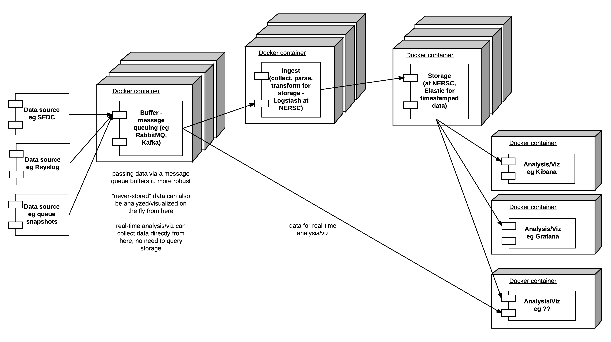
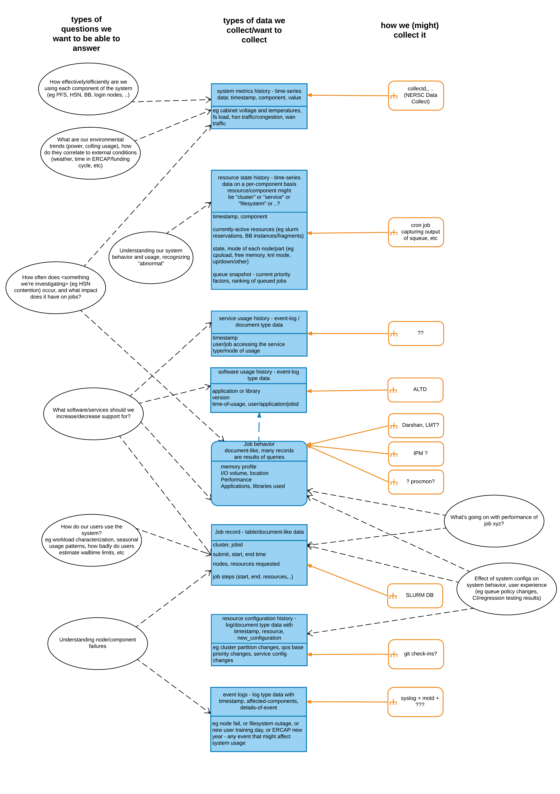

# Defining a reference architecture

Things we need to establish are:

- What should be the priorities? (i.e. what things to monitor?)  
  List of candidates:  
    - ERD endpoint or otherwise forwarding SEDC data off by other means
    - Viz with Graphana, using container with support infrastructure built
    - High frequency/high bandwidth data: live view only, never store
    - Back end database technologies: Retention, reduction, archival 
      considerations
    - Alerting: how to do, considerations
    - Transports: considerations and options
    - Non-web options for using, consuming, transporting, etc....

- What constraints should we consider?  
  i.e. what is a reasonable minimum commitment of hardware or software for the
  reference architecture to require?

## Architecture vision

The architecture is based on NERSC's Data Collect, and we plan to create 
DockerFiles describing each component and a docker-compose file describing how 
they interact. This should allow the architecture to be implemented on as 
little as a single service node but also to be scaled up to a monitoring 
cluster

The architecture is described by the following block diagram:

The two central components are the message queue and the storage.

### Message Queue

The message buffer/queue serves a few purposes:

- Single consistent interface

- Robustness
  The message buffer can be scaled out for redundancy and prevents data from 
  being lost due some specific component being unavailable

- Scalability
  More data collection can be supported by spinning up more buffer containers

- Flexibility
  Storage need not be the only component using incoming data, we can also eg
  send high-bandwidth data to a real-time visualizer component

#### Which message queueing system to use?

[RabbitMQ](https://www.rabbitmq.com/) and [Kafka](https://kafka.apache.org/) 
are well-known options, they approach the problem differently. 
[This blog post](https://content.pivotal.io/blog/understanding-when-to-use-rabbitmq-or-apache-kafka)
is a helpful overview. The NERSC Data Collect uses RabbitMQ, it takes a "smart
broker, dumb consumer" view, while Kafka takes the opposite. RabbitMQ is more 
mature, Kafka is more performance-oriented. We'll use RabbitMQ here.

#### Which storage to use?

There are *many* databases to choose from. NESRC undertook an exercise to 
identify the questions we want data collection to help answer, and what types
of data collection we are using or might use. The diagram below is a very broad
summary of what we found. Summarizing it further: most data is either 
time-series metrics, snaphots and logs, or document/record-oriented data (also
with time fields).

For insert-heavy workloads with challenging performance requirements, NoSQL 
databases tend to perform well. NERSC is using ElasticSearch (document-oriented
database) and we will use the same here.

 
